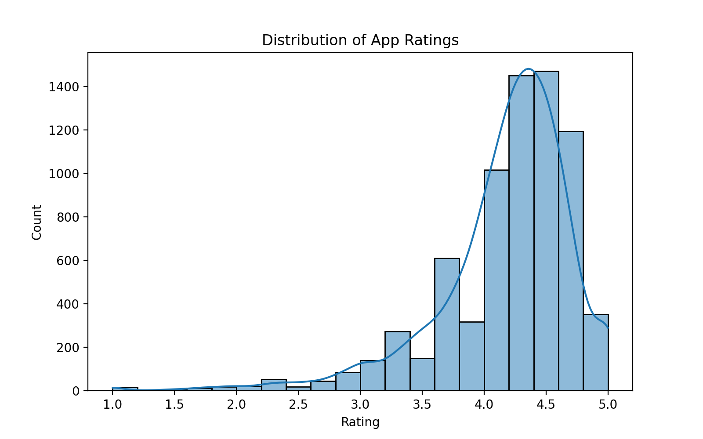
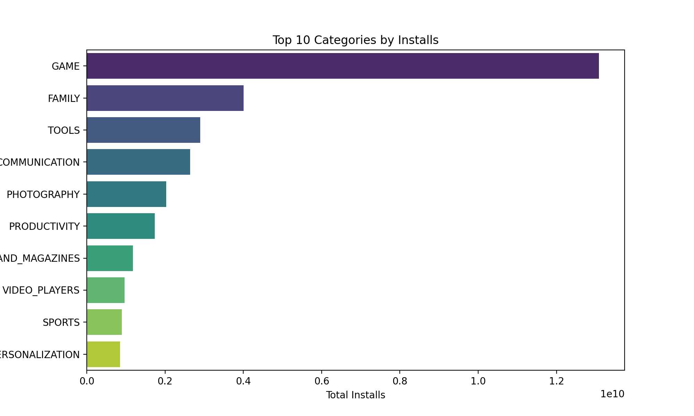

# 📱 Exploratory Data Analysis on Google Play Store Dataset

[](https://www.python.org/)  
[](https://jupyter.org/)  
[](https://www.kaggle.com/datasets/lava18/google-play-store-apps)  
[](https://github.com/burakkyildiz/GooglePlayEDA)  
[](https://opensource.org/licenses/MIT)  

## 📌 Project Overview
This project explores the **Google Play Store Apps Dataset** from Kaggle.  
The goal is to practice **Exploratory Data Analysis (EDA)**, including data cleaning, visualization, and extracting meaningful insights about mobile applications.

Dataset: [Google Play Store Apps](https://www.kaggle.com/datasets/lava18/google-play-store-apps)

---

## 📊 About the Dataset
- 10,000+ apps scraped from Google Play Store  
- Features include: `App`, `Category`, `Rating`, `Reviews`, `Installs`, `Price`, `Content Rating`, `Genres`, etc.  
- Provides insights into user preferences, app popularity, and app store trends.

---

## 🛠 Tools & Libraries
- Python 🐍  
- Jupyter Notebook 📓  
- pandas, numpy  
- matplotlib, seaborn  

---

## 🔍 EDA Steps
1. **Loading & Inspecting Data**  
   - Used `.head()`, `.info()`, `.describe()` to understand the structure.  

2. **Handling Missing & Incorrect Values**  
   - Dropped or imputed missing values  
   - Converted categorical columns  

3. **Data Cleaning & Transformation**  
   - Converted `Installs` and `Price` to numerical  
   - Removed duplicates  

4. **Visualization**  
   - Distribution of app ratings  
   - Most popular categories  
   - Relationship between reviews and installs  
---

## 📈 Key Insights
- Free apps dominate the Play Store in terms of installs.  
- Higher-rated apps are often niche categories rather than mass-market.  
- Strong correlation between review count and installs.  

## 📈 Example Visualizations
📊 **App Rating Distribution**  
Most apps have ratings between 4.0 and 4.5.  

  

> This shows that the majority of apps are well-rated, indicating generally high user satisfaction.

📊 **Top 10 Categories by Installs**  
The most downloaded apps belong to categories like `GAME`, `FAMILY`, and `TOOLS`.  

  

> Categories like `GAME` dominate the Play Store, highlighting user preference for entertainment apps.

## 🚀 How to Run
Clone the repository and open the terminal:

```bash
git clone https://github.com/burakkyildiz/GooglePlayEDA.git
cd GooglePlayEDA
jupyter notebook
```
---

## 🙏 Acknowledgements
- Dataset by [Kaggle](https://www.kaggle.com/datasets/lava18/google-play-store-apps)  
- Python community & open-source libraries  
